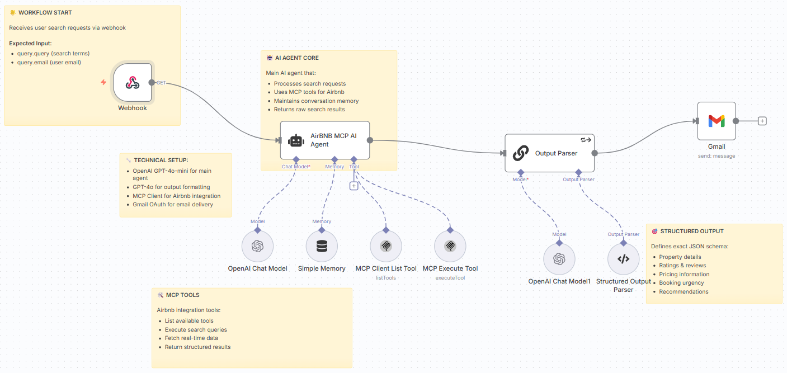

# 🏠 Airbnb n8n Workflow

This folder contains the **Airbnb Search Automation Workflow** for n8n.

---

## ✨ Overview
This workflow automates the process of searching Airbnb listings based on user queries submitted from the frontend app. It leverages 🤖 AI and the 🛠️ MCP Client to fetch, process, and email personalized Airbnb recommendations.

### 🚀 Key Features
- 📥 Receives search requests via webhook from the frontend
- 🤖 Uses AI (OpenAI) to interpret and enrich user queries
- 🌐 Connects to the Airbnb MCP tool for real-time listing data
- 📨 Parses and formats results for email delivery
- 💌 Sends a detailed, styled email with recommendations to the user

---

## 🔄 How It Works
1. 📝 **User submits a search** (location, dates, guests, etc.) via the frontend form.
2. 🌐 **Frontend calls the n8n webhook** (`/webhook/2586fd7a-0113-4719-8038-9b59cbcea6e0`) with the query, email, and name.
3. ⚙️ **Workflow processes the request:**
   - 🤖 AI agent interprets the query and fetches listings using the MCP Client.
   - 🗂️ Results are parsed and formatted.
   - 📧 An email is sent to the user with the best Airbnb options.

---

## 🏛️ Architecture



---

## 🛂 Inputs
- 🏖️ `query`: Description of the desired Airbnb stay (location, features, dates, etc.)
- 📧 `email`: User's email address (for results delivery)
- 🙋‍♂️ `name`: User's name

## 📤 Outputs
- 💌 Sends a personalized email with Airbnb listings and recommendations to the user.

---

## ⚙️ Setup
1. 🗃️ Import `airbnb_agent.json` into your n8n instance.
2. 🔑 Configure credentials for:
   - 🤖 OpenAI (for AI agent)
   - 🛠️ MCP Client (STDIO)
   - 📧 Gmail (for email delivery)
3. 🚀 Deploy the workflow and copy the webhook URL to your frontend.

---

## 🔗 Integration with Frontend
- The frontend app in `chrono-voyage-ai` is pre-configured to send requests to this workflow's webhook.
- Make sure the webhook URL matches in both places.

---

## 📚 References
- 🎥 [YouTube Setup Tutorial](https://youtu.be/C_FSNLCPx_Q)

## 🎓 Ready to Level-Up?
Join our courses on Maven and never stop learning:
- 🤖 [Agentic AI System Design for PMs — _For Leaders, Managers & Career Builders_](https://maven.com/boring-bot/ml-system-design?promoCode=201OFF)
- 💻 [Agent Engineering Bootcamp: Developers Edition — _For Developers, Engineers & Researchers_](https://maven.com/boring-bot/advanced-llm?promoCode=200OFF)

---

## 🔔 Price Tracking (Subscription) — Implementation Guide

This project supports a price-tracking feature: users can opt-in to receive periodic price updates for their search query. Below are step-by-step instructions and an importable n8n snippet you can use to add subscription handling and scheduling.

1) Frontend changes (already applied)
- `TravelForm` now includes a `priceTracking` checkbox and `frequency` selector (`daily|weekly|monthly`). It sends `priceTracking` and `frequency` as webhook query params.

2) n8n subscription endpoints
- Add two new webhook nodes to your n8n instance:
   - **Subscribe Webhook** (e.g. `/webhook/airbnb-subscribe`) — accepts `query`, `email`, `name`, `frequency` and creates a subscription record.
   - **Unsubscribe Webhook** (e.g. `/webhook/airbnb-unsubscribe`) — accepts `email` and `query` to remove a subscription.

3) Persistence
- Persist subscriptions in a simple datastore. Options:
   - Google Sheets (append/delete rows) — quick to set up in n8n using the Google Sheets node.
   - Airtable or MySQL/Postgres — better for production and querying.

4) Confirmation emails
- After subscribing/unsubscribing, send a confirmation email using the existing Gmail node. Include an unsubscribe link pointing to the Unsubscribe webhook.

5) Scheduler
- Add a Cron node in n8n that runs daily (or hourly) and:
   - Reads all subscriptions from storage (Google Sheets / DB).
   - For each subscription, call the same search flow (either by triggering the main webhook with the saved query, or by invoking the agent node directly) and email results to the subscriber.

6) Rate limits & safety
- Throttle scheduler runs to respect MCP/API limits (process in batches). Add retries and error handling when MCP tools fail.

7) Privacy & opt-out
- Store only minimal data (email + query + frequency + createdAt). Do not store sensitive personal data.
- Provide a clear unsubscribe link in every email and honor unsubscribe requests promptly.

Importable n8n snippet (example)

Below is a small workflow fragment you can import into n8n to create the Subscribe flow (adjust credentials and webhook IDs before importing):

```
{
   "nodes": [
      {
         "parameters": {
            "path": "airbnb-subscribe",
            "options": {}
         },
         "type": "n8n-nodes-base.webhook",
         "typeVersion": 2,
         "position": [250, 300],
         "name": "Subscribe Webhook",
         "webhookId": "airbnb-subscribe-hook"
      },
      {
         "parameters": {
            "values": {
               "string": [
                  { "name": "email", "value": "={{ $json[\"email\"] || $query.email }}" },
                  { "name": "query", "value": "={{ $json[\"query\"] || $query.query }}" },
                  { "name": "frequency", "value": "={{ $json[\"frequency\"] || $query.frequency || 'weekly' }}" }
               ]
            },
            "options": {}
         },
         "type": "n8n-nodes-base.set",
         "typeVersion": 1,
         "position": [480, 300],
         "name": "Build Subscription Record"
      },
      {
         "parameters": {
            "operation": "append",
            "sheetId": "YOUR_SHEET_ID_HERE",
            "range": "A1",
            "options": {
               "valueInputMode": "USER_ENTERED"
            }
         },
         "type": "n8n-nodes-base.googleSheets",
         "typeVersion": 1,
         "position": [720, 300],
         "name": "Save Subscription (Google Sheets)",
         "credentials": {
            "googleSheetsOAuth2": {
               "id": "YOUR_GOOGLE_SHEETS_CRED_ID",
               "name": "Google Sheets"
            }
         }
      },
      {
         "parameters": {
            "sendTo": "={{ $json.email }}",
            "subject": "Subscription confirmed: Price tracking enabled",
            "message": "=Hi,\n\nWe've enabled price tracking for your query: {{ $json.query }}. You'll receive updates {{ $json.frequency }}.\n\nTo unsubscribe, visit: <UNSUBSCRIBE_URL>?email={{ $json.email }}&query={{ encodeURIComponent($json.query) }}"
         },
         "type": "n8n-nodes-base.gmail",
         "typeVersion": 2.1,
         "position": [960, 300],
         "name": "Send Confirmation Email"
      }
   ],
   "connections": {
      "Subscribe Webhook": { "main": [[{ "node": "Build Subscription Record", "type": "main", "index": 0 }]] },
      "Build Subscription Record": { "main": [[{ "node": "Save Subscription (Google Sheets)", "type": "main", "index": 0 }]] },
      "Save Subscription (Google Sheets)": { "main": [[{ "node": "Send Confirmation Email", "type": "main", "index": 0 }]] }
   }
}
```

Notes:
- Replace `YOUR_SHEET_ID_HERE` and Google Sheets creds with your own.
- Update the unsubscribe URL to hit your Unsubscribe webhook.

If you'd like, I can:
- Import and patch `airbnb_agent.json` to include Subscribe/Unsubscribe nodes and a Cron scheduler (I will leave credential placeholders for security).
- Create an example Google Sheets schema and an exportable workflow JSON you can import directly into n8n.
- Implement server-side persistence (e.g., a small SQLite or Postgres table) and update the scheduler logic.

Which option do you want me to implement next? (I recommend importing the Subscribe nodes first, then adding a Cron scheduler that reads subscriptions and triggers the existing search webhook.)

